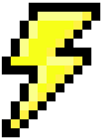
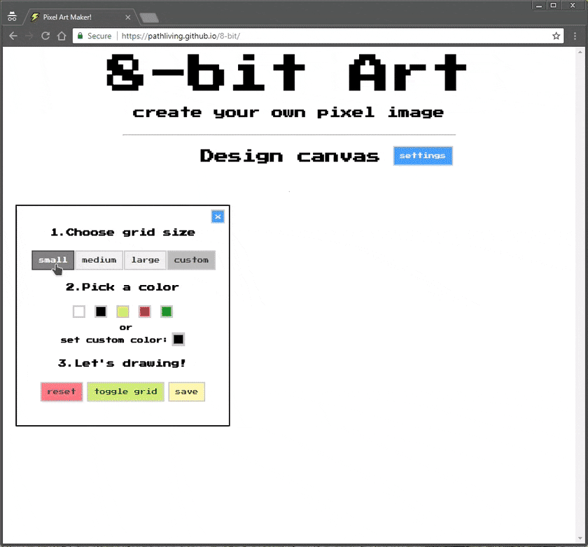

8-bit Art
====
> Create your own pixel image with my tool

The project was created exclusively for ~~educational purposes~~ the purpose of adding it to the portfolio in the future

Example
---

How it work
---

1. Open link: https://pathliving.github.io/8-bit/

2. Choose grid size:

		small, medium, large or custom [from 1x1 to 100x100]

3. Pick a color:

		on board [white, black, yellow, red, green] or custom

4. Drawing:

		drawing on the grid and use white color for erasing unnecessary pixels

5. Save your pixel image: 

		only for Chrome/Opera browsers

Built with
---

* [HTML](https://developer.mozilla.org/en-US/docs/Web/HTML)
* [CSS](https://developer.mozilla.org/en-US/docs/Web/CSS)
* [jQuery](http://api.jquery.com/) 

Support
---
1) Cross-browser compatibility 

		Chrome, Firefox, Safari, Edge, Opera
		IE - disable content (styles are rendering incorrectly)

2) Cross-platform

		Chrome, Firefox, Edge, Opera - on Windows
		Chrome, Firefox, Safari, Opera - on OSX

3) Responsive, adaptive and mobile compatibility client-side

		Desktop, laptop, tablet, fablet, mobile

Links
---

This project was using [GitHub Pages](https://pages.github.com/)

And with color picker [jscolor](http://jscolor.com)

Thanks for the idea [Una Kravets](https://una.im/sass-pixel-art/)
